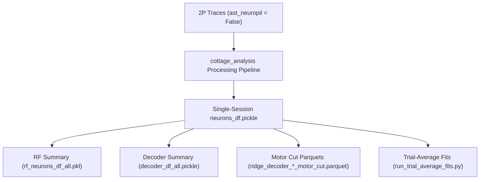

# 02 - Processing & Model Fitting Tracking

This document tracks all downstream computational processing, model fitting (Depth tuning, Receptive Fields, RS/OF integration, Ridge decoders), and the extraction and lineage of `neurons_df`.

---

## 1. Pipeline Overview & Data Lineage



> [!IMPORTANT]
> **Data Lineage Requirement**: All model fits and `neurons_df` must be computed with `filter_datasets={"anatomical_only": 3, "ast_neuropil": False}` to ensure consistency across figures and paper revisions.

---

## 1b. Outstanding items

Preprocessing is finished ([`01_preprocessing.md`](01_preprocessing.md)); everything below is downstream
fitting.

- [ ] **`analyze_all_sessions.py` for `PZAG16.3c_S20250401`** — re-extraction (Job `52280899`) and the
  `iscell` fix are both done, so the session is ready to fit. Currently **RUNNING** as Job `52334522`
  (submitted 2026-08-21 10:41). Note this is the **second** attempt: Job `52301162` COMPLETED (9h43m) at
  09:36, eight `gaussian_*` fit jobs were launched, six were CANCELLED at 10:04, and the pipeline was
  resubmitted. Confirm why the first pass was discarded before trusting its fits.
(Size control is settled — see §4.1. The `merge_fit_dataframes` failure was benign.)

---

## 2. Model Fitting Modules

| Fit Target | Pipeline / Script | Key Output File(s) | Status | Uses ast:False |
| :--- | :--- | :--- | :---: | :---: |
| **Depth Selectivity** | `analyze_all_sessions.py` (`run_depth_fit=1`) | `neurons_df.pickle` | ✅ Run | ✅ Yes |
| **Receptive Field (RF)** | `submit_rf_only.py` / `analyze_all_sessions.py` | `rf_neurons_df_all.pkl`, `rf_all_sig.pkl` | ✅ Run | ✅ Yes |
| **RS / OF Integration** | `analyze_all_sessions.py` (`run_rsof_fit=1`) | `rsof_df.pickle`, `neurons_df.pickle` | ✅ Run | ✅ Yes |
| **Trial-Average Fits** | [run_trial_average_fits.py](../run_trial_average_fits.py) | Merged TA results | ✅ Slurm array ready | ✅ Yes |
| **Full Cut Decoder** | [run_full_cut.py](../run_full_cut.py) | `ridge_decoder_neurons_motor_cut.parquet` | ✅ Run | ✅ Yes |
| **Grid Subsets Decoder** | [run_grid_subsets.py](../run_grid_subsets.py) | `ridge_decoder_subsets_*.parquet` | ✅ Run | ✅ Yes |
| **Size Control** | `size_control_all_sessions.py` | `neurons_df_size_control.pickle` | ✅ Complete (merge step is a no-op, §4.1) | ✅ Yes |
| **RS/OF Simulation Control** | [`rerun_simulation_tdecay2_areanorm.py`](../v1_depth_map/precompute_data/rerun_simulation_tdecay2_areanorm.py) | `simulated_responses_fit_{treadmill,spheres}_2_0.15_circular.parquet` | ✅ Complete (Jobs `52276868`–`52276875`) | N/A (Sim) |

---

## 3. Merged Summary Datasets

The figures notebooks consume aggregated datasets saved under `v1_manuscript_figures/ver_rev1/`:

| Dataset | Path on External Drive (`/Volumes/BlackPasspo/v1_depth_map/processed/`) | Status | Notes |
| :--- | :--- | :---: | :--- |
| **RF Neurons Summary** | `v1_manuscript_figures/ver_rev1/rf_neurons_df_all.pickle` | ✅ Available | 14.3 GB (Full population RF params) |
| **Decoder Summary** | `v1_manuscript_figures/ver_rev1/decoder_df_all.pickle` | ✅ Available | 497 KB |
| **RF Significant ROIs** | `v1_manuscript_figures/ver_rev1/rf_all_sig.pkl` | ✅ Available | Significant depth/RF cells |
| **RF Gradient Bootstrap**| `v1_manuscript_figures/ver_rev1/rf_gradient_bootstraps.pkl` | ✅ Available | Gradient bootstrap distributions |
| **Motor Cut Ridge Neurons** | `ridge_decoder_neurons_motor_cut.parquet` | ✅ Available | Depth-orthogonal RS x OF target |
| **Motor Cut Predictions** | `ridge_decoder_predictions_motor_cut.parquet` | ✅ Available | Cross-validated trial predictions |

---

## 4. Single-Session `neurons_df` Status

### Project: `colasa_3d-vision_revisions`

| Mouse | Session | `neurons_df` Exists | From `ast_neuropil=False` | Depth Fit Done | RF Fit Done | RS/OF Fit Done |
| :--- | :--- | :---: | :---: | :---: | :---: | :---: |
| PZAG16.3b | `S20250224` | ✅ Yes | ✅ Yes | ✅ Yes | ✅ Yes | ✅ Yes |
| PZAG16.3b | `S20250225` | ✅ Yes | ✅ Yes | ✅ Yes | ✅ Yes | ✅ Yes |
| PZAG16.3b | `S20250226` | ✅ Yes | ✅ Yes | ✅ Yes | ✅ Yes | ✅ Yes |
| PZAG16.3b | `S20250310` | ✅ Yes | ✅ Yes | ✅ Yes | ✅ Yes | ✅ Yes |
| PZAG16.3b | `S20250313` | ✅ Yes | ✅ Yes | ✅ Yes | ✅ Yes | ✅ Yes |
| PZAG16.3b | `S20250317` | ✅ Yes | ✅ Yes | ✅ Yes | ✅ Yes | ✅ Yes |
| PZAG16.3b | `S20250401` | ✅ Yes | ✅ Yes | ✅ Yes | ✅ Yes | ✅ Yes |
| PZAG16.3c | `S20250219` | ✅ Yes | ✅ Yes | ✅ Yes | ✅ Yes | ✅ Yes |
| PZAG16.3c | `S20250220` | ✅ Yes | ✅ Yes | ✅ Yes | ✅ Yes | ✅ Yes |
| PZAG16.3c | `S20250221` | ✅ Yes | ✅ Yes | ✅ Yes | ✅ Yes | ✅ Yes |
| PZAG16.3c | `S20250310` | ✅ Yes | ✅ Yes | ✅ Yes | ✅ Yes | ✅ Yes |
| PZAG16.3c | `S20250313` | ✅ Yes | ✅ Yes | ✅ Yes | ✅ Yes | ✅ Yes |
| PZAG16.3c | `S20250317` | ✅ Yes | ✅ Yes | ✅ Yes | ✅ Yes | ✅ Yes |
| `PZAG16.3c` | `S20250401` | 🔄 Fitting (Job `52334522`) | ✅ Yes (Job `52280899`) | 🔄 Running | ❌ N/A (Motor) | 🔄 Running |
| PZAG17.3a | `S20250227` | ✅ Yes | ✅ Yes | ✅ Yes | ✅ Yes | ✅ Yes |
| PZAG17.3a | `S20250228` | ✅ Yes | ✅ Yes | ✅ Yes | ✅ Yes | ✅ Yes |
| PZAG17.3a | `S20250303` | ✅ Yes | ✅ Yes | ✅ Yes | ✅ Yes | ✅ Yes |
| PZAG17.3a | `S20250305` | ✅ Yes | ✅ Yes | ✅ Yes | ✅ Yes | ✅ Yes |
| PZAG17.3a | `S20250306` | ✅ Yes | ✅ Yes | ✅ Yes | ✅ Yes | ✅ Yes |
| PZAG17.3a | `S20250319` | ✅ Yes | ✅ Yes | ✅ Yes | ✅ Yes | ✅ Yes |
| PZAG17.3a | `S20250402` | ✅ Yes | ✅ Yes | ✅ Yes | ✅ Yes | ✅ Yes |
| PZAH17.1e | `S20250304` | ✅ Yes | ✅ Yes | ✅ Yes | ✅ Yes | ✅ Yes |
| PZAH17.1e | `S20250305` | ✅ Yes | ✅ Yes | ✅ Yes | ✅ Yes | ✅ Yes |
| PZAH17.1e | `S20250306` | ✅ Yes | ✅ Yes | ✅ Validated (Multidays Day 3) | ✅ Yes | ✅ Yes |
| PZAH17.1e | `S20250307` | ✅ Yes | ✅ Yes | ✅ Yes | ✅ Yes | ✅ Yes |
| PZAH17.1e | `S20250311` | ✅ Yes | ✅ Yes | ✅ Yes | ✅ Yes | ✅ Yes |
| PZAH17.1e | `S20250313` | ✅ Yes | ✅ Yes | ✅ Yes | ✅ Yes | ✅ Yes |
| PZAH17.1e | `S20250318` | ✅ Yes | ✅ Yes | ✅ Yes | ✅ Yes | ✅ Yes |
| PZAH17.1e | `S20250403` | ✅ Yes | ✅ Yes | ✅ Yes | ✅ Yes | ✅ Yes |

### Project: `hey2_3d-vision_foodres_20220101` (Key Size-Control Sessions)

| Mouse | Session | `neurons_df` Exists | From `ast_neuropil=False` | Action Needed |
| :--- | :--- | :---: | :---: | :--- |
| PZAH10.2d | `S20230822` | ✅ Yes | ✅ Yes (Job `52277005`) | None. See §4.1 — merge step is a no-op here. |
| PZAH10.2f | `S20230815` | ✅ Yes | ✅ Yes (Job `52277006`) | None. See §4.1 — merge step is a no-op here. |
| PZAH10.2f | `S20230907` | ✅ Yes | ✅ Yes (Job `52277007`) | None. See §4.1 — merge step is a no-op here. |

#### 4.1 Size-control merge failure (2026-08-21) — ✅ benign, resolved

The ast:False **trace** re-runs succeeded (`52277005/6/7`, all exit 0 — these are preprocessing and are
settled). The **analysis** pipeline then failed on all three sessions:

| Job | Session | Outcome |
| :--- | :--- | :--- |
| `52298814` | `PZAH10.2d_S20230822` | ❌ FAILED after 2h34m |
| `52298813` | `PZAH10.2f_S20230907` | ❌ FAILED after 2h37m |
| `52298815` | `PZAH10.2f_S20230815` | ❌ FAILED after 14m |
| `52300919` | `PZAH10.2f_S20230815` (retry) | ❌ FAILED after 1h41m |

All four died identically — after the fits completed, in `merge_fit_dataframes`
(`pipeline_utils.py:447`, reached from `analysis_pipeline_size_control.py:295`):

```
FileNotFoundError: [Errno 2] No such file or directory:
  .../hey2_3d-vision_foodres_20220101/PZAH10.2f/S20230815/neurons_df.pickle
```

**Cause**: the old outputs were moved into `stale_pre_20260820/` on 2026-08-20 23:13, so `neurons_df.pickle`
genuinely did not exist when the merge tried to read it. The fits themselves had already completed and were
written to `neurons_df_size_control.pickle`.

**The merge is a no-op for these sessions, so nothing was lost.** It is called with `prefix="neurons_df"`,
`suffix="_size_control"`, so its glob matches only the size-control file itself, and `columns_to_add` comes
out empty. The step exists to fold size-control columns into a *pre-existing standard* `neurons_df` — and
these three sessions are size-control-only, with no standard depth/RS-OF run to fold into.

Confirmed against the last successful run: in `stale_pre_20260820/` (July, when the merge did execute),
`neurons_df.pickle` is `assert_frame_equal`-identical to `neurons_df_size_control.pickle` for all three
sessions — same 47 columns, same values. A completed merge produces exactly what a copy produces. (The
~1.7 KB file-size difference there is pickle-writer overhead, not content.)

**Resolution**: `neurons_df.pickle` was restored from `neurons_df_size_control.pickle` on 08:47, which is
byte-identical and is the filename [`figsupp_size_control.ipynb`](../v1_depth_map/figures/figsupp_size_control.ipynb)
cell 3 reads. No re-run needed.

> [!CAUTION]
> This equivalence holds **only** because these sessions have no standard-pipeline `neurons_df`. If any of
> them ever gets a normal depth/RS-OF run, copying the size-control file over `neurons_df.pickle` would
> clobber it and the merge step becomes load-bearing.

---

## 5. Execution Commands & Scripts

### Run Batch Analysis Pipeline on Slurm
```bash
# In v1_depth_map/batch_analysis/batch_analysis/
python analyze_all_sessions.py
```

### Run Motor Cut Ridge Decoders
```bash
python run_full_cut.py
```

### Run Trial-Averaged Model Fits
```bash
python run_trial_average_fits.py
```

### Run RS/OF Simulation Control Re-run (`decay_tau=2`, area-normalized)
```bash
python v1_depth_map/precompute_data/rerun_simulation_tdecay2_areanorm.py
```

### Run Size Control Analysis Pipeline
```bash
# In v1_depth_map/batch_analysis/batch_size_control/
python size_control_all_sessions.py
```

---

## 6. Recent Slurm Job History

### 1. 2P Re-extraction: `PZAG16.3c_S20250401` — ✅ COMPLETED
- **Job ID**: `52280899` (`ga100`, `mem=64G`) — Exit 0 (1h33m).
- **Result**: Post-fix middle-frame offsets (`[-18.72, -20.06]`) baked into traces; `iscell` repaired to 639 curated cells.

### 1b. Analysis Pipeline: `PZAG16.3c_S20250401` — 🔄 RUNNING
- `52301162` — COMPLETED (9h43m), ended 2026-08-21 09:36. Fits launched, then mostly cancelled.
- `52331665`, `52331667`, `52331671` (`gaussian_2d_crossval_k1`, `gaussian_OF_k1`, `gaussian_ratio_k1`) — COMPLETED.
- `52331664`, `52331666`, `52331668`–`52331670`, `52331672`–`52331674` — CANCELLED at 10:04.
- `52334522` — **RUNNING** since 10:41 (resubmit of the full pipeline).

### 2. Size Control 2P Trace Reruns (`ast_neuropil=False`) — ✅ COMPLETED
- **Jobs**:
  - `52277005`: `PZAH10.2d_S20230822` (483 ROIs) — Exit 0 (31m).
  - `52277006`: `PZAH10.2f_S20230815` (647 ROIs) — Exit 0 (54m).
  - `52277007`: `PZAH10.2f_S20230907` (692 ROIs) — Exit 0 (43m).
- **Result**: ast:False traces in place. The downstream `size_control_all_sessions.py` runs then failed at
  the merge step, benignly — see §4.1.

### 3. RS/OF Simulation Re-run (`rerun_simulation_tdecay2_areanorm.py`) — ✅ COMPLETED
- **Jobs**: `52276868`–`52276875` (`ncpu`, `8G`, exit 0).
- **Configuration**: `decay_tau = 2`, `rise_tau = 0.15`, `make_circular = True`, `kernel_normalization = "area"`.
- **Output Generated**: `simulated_responses_fit_{treadmill,spheres}_2_0.15_circular.parquet` for all 4 motor sessions (`PZAG17.3a_S20250402`, `PZAG16.3c_S20250401`, `PZAG16.3b_S20250401`, `PZAH17.1e_S20250403`).
- **Post-Run Action**: Drop the temporary `tread_kwargs=dict(method="model")` override in cell 10 of `figsupp_simulation_control.ipynb` and execute.
