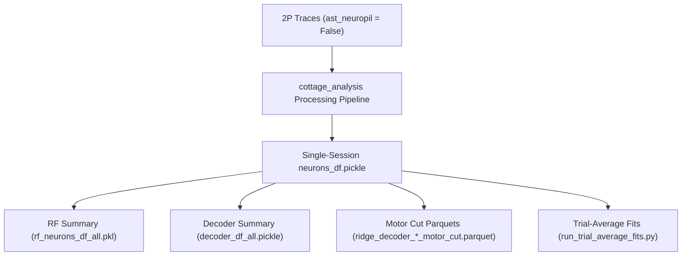

# 02 - Processing & Model Fitting Tracking

This document tracks downstream computational processing — model fitting (depth tuning, receptive fields,
RS/OF integration, ridge decoders) and the state and lineage of `neurons_df`.

Preprocessing is finished ([`01_preprocessing.md`](01_preprocessing.md)); everything below is downstream
fitting. **All fitting is complete as of 2026-08-25** — verified 2026-08-27: nothing queued or running on
nemo, and the column families and depth-cell counts on disk match this document.

---

## 1. Pipeline Overview & Data Lineage



> [!IMPORTANT]
> **Data Lineage Requirement**: All model fits and `neurons_df` must be computed with
> `filter_datasets={"anatomical_only": 3, "ast_neuropil": False}` to ensure consistency across figures and
> paper revisions.

---

## 2. Outstanding items

Fitting is done. What remains is notebook-side:

1. Re-execute the figure notebooks. **Now required, not cosmetic**: the treadmill trial-average g2d fits
   were re-run with tightened `param_range` bounds (§6.2), so
   `_treadmill_trial_average_plateau` g2d values have genuinely changed. (The earlier reason was only that
   stored outputs showed pre-migration column names, every column being numerically identical then.)
   Affected: [`figure_depth_cells.ipynb`](../v1_depth_map/figures/figure_depth_cells.ipynb),
   [`figure_rsof_integration.ipynb`](../v1_depth_map/figures/figure_rsof_integration.ipynb),
   [`revisions/treadmill.ipynb`](../v1_depth_map/revisions/treadmill.ipynb).
2. Drop the temporary `tread_kwargs=dict(method="model")` override in
   [`figsupp_simulation_control.ipynb`](../v1_depth_map/figures/figsupp_simulation_control.ipynb) cell 10.
   Unblocked now that `_treadmill` is plateau.
3. `presentations/` notebooks are frozen and read suffixes that changed meaning — see §6.

---

## 3. Model Fitting Modules

| Fit Target | Pipeline / Script | Key Output File(s) | Uses ast:False |
| :--- | :--- | :--- | :---: |
| **Depth Selectivity** | `analyze_all_sessions.py` (`run_depth_fit=1`) | `neurons_df.pickle` | ✅ |
| **Receptive Field (RF)** | `submit_rf_only.py` / `analyze_all_sessions.py` | `rf_neurons_df_all.pkl`, `rf_all_sig.pkl` | ✅ |
| **RS / OF Integration** | `analyze_all_sessions.py` (`run_rsof_fit=1`) | `rsof_df.pickle`, `neurons_df.pickle` | ✅ |
| **Trial-Average Fits** | [run_trial_average_fits.py](../run_trial_average_fits.py) | Merged TA results | ✅ |
| **Full Cut Decoder** | [run_full_cut.py](../run_full_cut.py) | `ridge_decoder_neurons_motor_cut.parquet` | ✅ |
| **Grid Subsets Decoder** | [run_grid_subsets.py](../run_grid_subsets.py) | `ridge_decoder_subsets_*.parquet` | ✅ |
| **Size Control** | `size_control_all_sessions.py` | `neurons_df_size_control.pickle` | ✅ |
| **RS/OF Simulation Control** | [`rerun_simulation_tdecay2_areanorm.py`](../v1_depth_map/precompute_data/rerun_simulation_tdecay2_areanorm.py) | `simulated_responses_fit_{treadmill,spheres}_2_0.15_circular.parquet` | N/A (sim) |

All run and complete. Simulation control used `decay_tau = 2`, `rise_tau = 0.15`, `make_circular = True`,
`kernel_normalization = "area"`, for the four motor sessions.

---

## 4. Merged Summary Datasets

The figure notebooks consume aggregated datasets under
`/Volumes/BlackPasspo/v1_depth_map/processed/v1_manuscript_figures/ver_rev1/`:

| Dataset | File | Notes |
| :--- | :--- | :--- |
| **RF Neurons Summary** | `rf_neurons_df_all.pickle` | 14.3 GB (full-population RF params) |
| **Decoder Summary** | `decoder_df_all.pickle` | 497 KB |
| **RF Significant ROIs** | `rf_all_sig.pkl` | Significant depth/RF cells |
| **RF Gradient Bootstrap** | `rf_gradient_bootstraps.pkl` | Gradient bootstrap distributions |
| **Motor Cut Ridge Neurons** | `ridge_decoder_neurons_motor_cut.parquet` | Depth-orthogonal RS × OF target |
| **Motor Cut Predictions** | `ridge_decoder_predictions_motor_cut.parquet` | Cross-validated trial predictions |

---

## 5. Single-Session `neurons_df` Status

### Project: `colasa_3d-vision_revisions`

All sessions below have `neurons_df` from `ast_neuropil=False` traces, with depth, RF and RS/OF fits done.

| Mouse | Sessions |
| :--- | :--- |
| PZAG16.3b | `S20250224`, `S20250225`, `S20250226`, `S20250310`, `S20250313`, `S20250317`, `S20250401` |
| PZAG16.3c | `S20250219`, `S20250220`, `S20250221`, `S20250310`, `S20250313`, `S20250317`, `S20250401`\* |
| PZAG17.3a | `S20250227`, `S20250228`, `S20250303`, `S20250305`, `S20250306`, `S20250319`, `S20250402` |
| PZAH17.1e | `S20250304`, `S20250305`, `S20250306`, `S20250307`, `S20250311`, `S20250313`, `S20250318`, `S20250403` |

\* `PZAG16.3c_S20250401` has no RF fit (motor session). It was fully refit on re-extracted traces
(2026-08-25) and now carries the complete 2×2 RS/OF grid — see §6.

The four **motor** sessions (`PZAG16.3b_S20250401`, `PZAG16.3c_S20250401`, `PZAG17.3a_S20250402`,
`PZAH17.1e_S20250403`) are the ones carrying `_treadmill*` columns.

### Project: `hey2_3d-vision_foodres_20220101` (size control)

`PZAH10.2d_S20230822`, `PZAH10.2f_S20230815`, `PZAH10.2f_S20230907` — all present, all from ast:False
traces, no action needed.

> [!CAUTION]
> For these three, `neurons_df.pickle` is a copy of `neurons_df_size_control.pickle`. That is only valid
> because they have **no** standard-pipeline run: `merge_fit_dataframes` is a genuine no-op for them
> (its glob matches only the size-control file, so `columns_to_add` is empty). If any of them ever gets a
> normal depth/RS-OF run, the merge step becomes load-bearing and the copy would clobber it.

---

## 6. Treadmill column naming convention (settled 2026-08-24)

### The bug this fixes

`treadmill.sync_all_recordings` has two onset-detection methods, `plateau` and `model`.
`analysis_pipeline.py` never passed `method`, so when cottage_analysis `c4ea1cd` (2026-08-17) flipped the
default from `model` to `plateau`, **the change left no trace in any filename or column name** — the same
column name meant `model` in three sessions and `plateau` in the fourth, silently incomparable.

### The convention

Depth tuning reduces each trial to its trial-mean dF/F, so it has no per-frame/trial-average axis — only
the onset method distinguishes depth fits. RS/OF has both axes. **The method is always explicit**, with one
deliberate exception: bare `_treadmill` *is* the plateau family, because it is read at ~240 hardcoded sites
across the figures and notebooks and renaming it would have been far riskier than fixing what it means.

| Suffix | Depth | RS/OF |
| :--- | :--- | :--- |
| `_treadmill` | plateau | per-frame, plateau |
| `_treadmill_plateau` | plateau (identical twin of `_treadmill`) | — |
| `_treadmill_model` | model | per-frame, model |
| `_treadmill_trial_average_plateau` | — | trial-average, plateau ← **what the figures read** |
| `_treadmill_trial_average_model` | — | trial-average, model |

> [!IMPORTANT]
> Invariant: no treadmill family may mix onset methods, and a suffix means the same thing in every session.
> Enforced by
> [`revisions/migrate_treadmill_columns.py`](../v1_depth_map/revisions/migrate_treadmill_columns.py)
> `--check`. The script is idempotent (`--dry-run` / `--apply` / `--check`) and backs up to
> `neurons_df.pickle.pre_treadmill_migration_backup`. Re-run `--apply` after any
> `merge_fit_dataframes`, which recreates the `rsof_minSigma_*_x`/`*_y` collision pairs every time.

> [!CAUTION]
> `minSigma` columns are **collapsed, not dropped**. [treadmill.py:654](../v1_depth_map/figure_utils/treadmill.py#L654)
> reads `rsof_minSigma_closedloop_g2d{ta}` to recover the fit's `min_sigma`, which feeds the ellipse
> geometry (eccentricity / semimajor / semiminor). Dropping them breaks `add_trial_average_rsof_columns`.

### Resulting state

RS/OF `_treadmill` is 84 columns in all four sessions; every family is present in all four.
`PZAG16.3c_S20250401` is 514 columns, the other three 543. `depth_sfx` may safely point at either
`_treadmill` or its identical twin `_treadmill_plateau`.

Verified: `--check` passes on all four; `_treadmill` depth agrees with `_treadmill_plateau` for 98–100% of
ROIs; `_treadmill_model` depth agrees with plateau for only 9–14%, confirming the rename tagged genuinely
different fits; **every column the figures read is numerically identical pre/post migration** in all four
sessions (array-valued columns compared with `np.allclose`, not `Series.equals`);
`add_trial_average_rsof_columns` runs clean and resolves `min_sigma=0.25`.

### 6.1 The NaN-contamination bug this exposed (2026-08-25)

Promoting the plateau depth columns onto `_treadmill` initially left **three of four sessions with zero
depth cells**, so every population panel silently collapsed to `PZAG16.3c_S20250401` alone.

**Root cause**: neither `common_utils.calculate_r_squared` nor `scipy.stats.spearmanr` is NaN-aware. A trial
whose frames are all removed (plateau onset detection keeps a narrower window than the model method, and
`max_rs2motor_diff=0.3` filtering then empties some trials outright) has a NaN trial mean, and **one** NaN
in the concatenated held-out set forces the statistic to NaN **for the entire ROI**. `preferred_depth`
survived because it comes from the all-trials fit, which has no held-out set — which is exactly why the
family looked complete.

`cottage_analysis` `dev` already had the fix (`46d7c0c` "[bugfix] drop nan before calculating rsq"); it was
ported to `reviews`, mask-then-score. Only that hunk was taken — `reviews..dev` differs by ~150 lines
across these files and the rest is unrelated.

A **second instance of the same hazard** was found in `find_depth_neurons`: `scipy.stats.f_oneway` is
likewise not NaN-aware, so `depth_neuron_anova_p{sfx}` came out NaN and `is_depth_neuron{sfx} = p < alpha`
was all-False. `dev` does **not** fix this one. It matters because the production pipeline takes
`is_depth_neuron_treadmill` straight from that ANOVA and now defaults to plateau, so any future treadmill
run would have hit the same silent failure. Fixed here by dropping NaN per depth group and requiring two
groups with two usable trials; verified bit-exact no-op when nothing is filtered.

Depth cells after the refit — `is_depth_neuron_treadmill`, re-verified 2026-08-27:

| Session | before | after |
| :--- | ---: | ---: |
| `PZAG16.3b_S20250401` | 0 | 185 |
| `PZAG17.3a_S20250402` | 0 | 152 |
| `PZAH17.1e_S20250403` | 0 | 200 |
| `PZAG16.3c_S20250401` | 227 | 227 (unaffected) |

The paper figure's population goes from 130 neurons in one session to **279 across all four**.

### 6.2 RS/OF fit bounds for the treadmill trial-average fits (2026-08-28)

`param_range` bounds only the **centre** of the fitted Gaussian — `x0` = log(RS in m/s), `y0` = log(OF in
deg/s); amplitude, sigmas and offset are unbounded
([`fit_gaussian_blob.initial_fit_conditions`](../../cottage_analysis/cottage_analysis/analysis/fit_gaussian_blob.py)).
It was the same literal everywhere, sized for the free-running sphere protocol:
`{"rs_min": 0.005, "rs_max": 5, "of_min": 0.03, "of_max": 3000}` — RS 0.5–500 cm/s, OF 0.03–3000 °/s.

**The bug this fixes.** The treadmill samples a box two orders of magnitude smaller: 5 belt speeds
(3.8125–61 cm/s, `treadmill.ACTUAL_MOTOR_SPEED`) × 6 optic flows (1–1024 °/s, `4 ** arange(6)`). With
bounds that loose, a large fraction of trial-average fits ran their preferred RS/OF out to a bound and
stopped there — the Gaussian degenerates into a monotonic ramp and the reported "preferred" value is an
artefact of the bound, not of the data. Measured on the pre-refit
`fit_rs_of_tuning_gaussian_2d_k1_treadmill_trial_average_legacy_plateau.pickle`:

| Session | n ROIs | pinned at `rs_min`/`rs_max` | pinned at `of_min`/`of_max` |
| :--- | ---: | ---: | ---: |
| `PZAG16.3b_S20250401` | 717 | 89 / 134 (31%) | 85 / 55 (20%) |
| `PZAG16.3c_S20250401` | 639 | 92 / 111 (32%) | 45 / 55 (16%) |
| `PZAG17.3a_S20250402` | 784 | 76 / 114 (24%) | 78 / 83 (21%) |
| `PZAH17.1e_S20250403` | 714 | 64 / 164 (32%) | 136 / 68 (29%) |

Median preferred RS was 14–25 cm/s and median preferred OF 24–38 °/s — comfortably inside the stimulus box
— so that tail was bound-driven, not signal-driven.

**The new bounds.** The protocol's own grid, padded by one minimum sigma. `min_sigma` is added to sigma
**squared** (`sigma_x_sq = exp(log_sigma_x2) + min_sigma`), so one actual sigma in natural-log units is
`sqrt(0.25) = 0.5` → a factor `e**0.5 = 1.6487` on each side:

| key | old | new | derivation |
| :--- | ---: | ---: | :--- |
| `rs_min` (m/s) | 0.005 | 0.023124 | 0.038125 / e^0.5 |
| `rs_max` (m/s) | 5 | 1.005720 | 0.61 × e^0.5 |
| `of_min` (°/s) | 0.03 | 0.606531 | 1 / e^0.5 |
| `of_max` (°/s) | 3000 | 1688.291 | 1024 × e^0.5 |

`param_range` is now **per fit target**, not shared in `COMMON_PARAMS`: only the trial-average `treadmill`
target is narrowed. `sphere` samples running speed freely and `treadmill_frames` must keep reproducing the
production per-frame `*_treadmill` columns, so both keep the wide default. Because every model in
`initial_fit_conditions` reads the same four keys, that one entry covers gof/grs/gadd/gratio too if they
are ever re-run for this target.

**Verified against the data, not just the constants.** `--check-range` (new, read-only) loads each session
and reports the empirical trial-averaged RS/OF box against the bounds. All four sessions: 0% of samples
outside. It also settled a real uncertainty — `expected_optic_flow` is rounded to powers of **2**, and
`treadmill.ipynb` cell 148 labels a 0.25 °/s condition, so `of_min` could have needed to be 0.1516. The
measured minimum OF is 0.894–0.935 °/s, confirming the slowest condition is 1 °/s.

| Session | trial averages | RS data (m/s) | OF data (°/s) |
| :--- | ---: | :--- | :--- |
| `PZAG16.3b_S20250401` | 149 | 0.0371–0.6106 | 0.927–1001.4 |
| `PZAG16.3c_S20250401` | 150 | 0.0373–0.6475 | 0.935–1034.3 |
| `PZAG17.3a_S20250402` | 224 | 0.0371–0.6113 | 0.894–1007.7 |
| `PZAH17.1e_S20250403` | 262 | 0.0378–0.6163 | 0.926–1003.1 |

Note `PZAG16.3c`'s max RS (0.6475) exceeds the 0.61 nominal belt speed — the animal ran slightly ahead of
the belt, within the `max_rs2motor_diff=0.3` tolerance. The one-sigma pad absorbs it, which is part of why
the pad is there.

**What was re-run**: the three `gaussian_2d` configs of the `treadmill` target under `--method plateau`
— `(None, k1)`, `("even", k1)`, `(None, k5)` — overwriting the `_treadmill_trial_average_plateau` family
in place.

> [!CAUTION]
> `fit_rs_of_tuning` records `min_sigma` in its output but **not** `param_range`, so an overwritten pickle
> carries no trace of which bounds produced it. Every run now writes `param_range_current.json` into the
> session folder (`.json` is invisible to `merge_fit_dataframes`' `*.pickle` glob). The pre-refit pickles
> are preserved per session in `paramrange_backup_wide_range_20260828/` with their original filenames plus
> a `param_range_backup.json`; `neurons_df` is backed up to
> `neurons_df.pickle.pre_g2d_treadmill_trial_average_plateau_paramrange_refit_20260828_backup`. A subfolder
> rather than a renamed file because the merge glob is non-recursive, so the backups are structurally
> invisible to it; restoring is a plain move back.

> [!IMPORTANT]
> `add_trial_average_rsof_columns` builds `best_model` and the per-model significance flags from
> `rsof_test_rsq_closedloop_{gof,grs,gadd,g2d,gratio}_treadmill_trial_average_plateau`
> ([treadmill.py:642](../v1_depth_map/figure_utils/treadmill.py#L642)). **g2d's test R² now comes from the
> tightened bounds while the other four models keep the wide ones**, so cross-model comparison on this
> family is no longer apples-to-apples. To restore it, re-run the remaining eight configs by dropping
> `--configs` — the per-target `param_range` already covers every model.

Naming: `HALVES` in `fit_revision_treadmill.py` was renamed to `FIT_TARGETS` (`half_config` →
`target_config`, `fit_session_half` → `fit_session_target`). "Halves" was literal when the script had one
entry per recording, but `treadmill_frames` is not a third half of the session — it is a second way of
fitting the same `SpheresTubeMotor` half. §6 above and `migrate_treadmill_columns.py` still describe the
same convention in "half" language; only the script changed.

---

## 7. Execution Commands

```bash
# Batch analysis pipeline (in v1_depth_map/batch_analysis/batch_analysis/)
python analyze_all_sessions.py

# Motor cut ridge decoders
python run_full_cut.py

# Trial-averaged model fits
python run_trial_average_fits.py

# RS/OF simulation control (decay_tau=2, area-normalized)
python v1_depth_map/precompute_data/rerun_simulation_tdecay2_areanorm.py

# Size control pipeline (in v1_depth_map/batch_analysis/batch_size_control/)
python size_control_all_sessions.py

# Treadmill column invariant check (run after any merge_fit_dataframes)
python v1_depth_map/revisions/migrate_treadmill_columns.py --check

# Treadmill trial-average g2d refit with the tightened param_range (§6.2).
# --check-range FIRST: read-only, confirms the bounds contain the stimulus.
python v1_depth_map/precompute_data/fit_revision_treadmill.py \
    --site local --only treadmill --method plateau --check-range
python v1_depth_map/precompute_data/fit_revision_treadmill.py \
    --site local --only treadmill --method plateau --redo \
    --configs gaussian_2d:None:1 gaussian_2d:even:1 gaussian_2d:None:5
python v1_depth_map/precompute_data/fit_revision_treadmill.py \
    --site local --only treadmill --method plateau --merge --conflicts overwrite
```

Helper artefacts left on nemo from the 3c refit: `~/fit_revision_treadmill.py`,
`~/inspect_neurons_df_cols.py`, `~/merge_ta_plateau/` (sbatch + logs).

Slurm job IDs, timings and failure post-mortems for the completed runs were moved to
[`archive/02_slurm_job_history_pre20260827.md`](archive/02_slurm_job_history_pre20260827.md).
