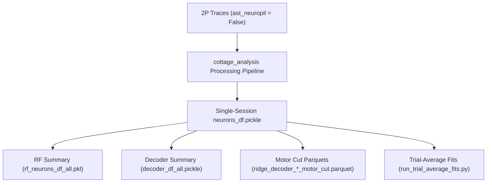

# 02 - Processing & Model Fitting Tracking

This document tracks downstream computational processing — model fitting (depth tuning, receptive fields,
RS/OF integration, ridge decoders) and the state and lineage of `neurons_df`.

> [!NOTE]
> **All model fitting and processing is complete.** All single-session `neurons_df` files, receptive field models,
> RS/OF tuning fits, decoders, and controls are computed, verified, and saved to disk. There are no running or
> queued jobs on NEMO. This file serves as the reference for data lineage, column conventions, bounds, and backups.

---

## 1. Pipeline Overview & Data Lineage



> [!IMPORTANT]
> **Data Lineage Requirement**: All model fits and `neurons_df` are computed with
> `filter_datasets={"anatomical_only": 3, "ast_neuropil": False}` to ensure consistency across figures and
> paper revisions.

---

## 2. Status & Outstanding Items

- **Model Fitting Status**: ✅ **100% Complete** across all sessions.
- **Figure Notebook Execution**:
  - [`figure_depth_cells.ipynb`](../v1_depth_map/figures/figure_depth_cells.ipynb): ✅ Re-executed with updated trial-average plateau g2d fits and elongation criteria (`fig_depth_cells.svg` generated).
  - [`figure_rsof_integration.ipynb`](../v1_depth_map/figures/figure_rsof_integration.ipynb): ✅ Re-executed with `_treadmill_trial_average_plateau` fits (`fig2.svg` and `fig2.pdf` generated).
  - [`figsupp_simulation_control.ipynb`](../v1_depth_map/figures/figsupp_simulation_control.ipynb): ✅ Updated to use plateau simulation data (`fig_supp_simulation_control.svg` generated).
- `presentations/` notebooks remain frozen reference artifacts reading historical column suffixes.

---

## 3. Model Fitting Modules

| Fit Target | Pipeline / Script | Key Output File(s) | Uses ast:False |
| :--- | :--- | :--- | :---: |
| **Depth Selectivity** | `analyze_all_sessions.py` (`run_depth_fit=1`) | `neurons_df.pickle` | ✅ |
| **Receptive Field (RF)** | `submit_rf_only.py` / `analyze_all_sessions.py` | `rf_neurons_df_all.pkl`, `rf_all_sig.pkl` | ✅ |
| **RS / OF Integration** | `analyze_all_sessions.py` (`run_rsof_fit=1`) | `rsof_df.pickle`, `neurons_df.pickle` | ✅ |
| **Trial-Average Fits** | [run_trial_average_fits.py](../run_trial_average_fits.py) | Merged TA results | ✅ |
| **Full Cut Decoder** | [run_full_cut.py](../run_full_cut.py) | `ridge_decoder_neurons_motor_cut.parquet` | ✅ |
| **Grid Subsets Decoder** | [run_grid_subsets.py](../run_grid_subsets.py) | `ridge_decoder_subsets_*.parquet` | ✅ |
| **Size Control** | `size_control_all_sessions.py` | `neurons_df_size_control.pickle` | ✅ |
| **RS/OF Simulation Control** | [`fit_revision_simulation.py`](../v1_depth_map/precompute_data/fit_revision_simulation.py) | `simulated_responses_fit_{treadmill,spheres}_2_0.15_circular.parquet`, `simulated_responses_fit_treadmill_trial_average_plateau_2_0.15_circular.parquet` | N/A (sim) |

---

## 4. Merged Summary Datasets

The figure notebooks consume aggregated datasets under
`/Volumes/BlackPasspo/v1_depth_map/processed/v1_manuscript_figures/ver_rev1/`:

| Dataset | File | Notes |
| :--- | :--- | :--- |
| **RF Neurons Summary** | `rf_neurons_df_all.pickle` | 14.3 GB (full-population RF params) |
| **Decoder Summary** | `decoder_df_all.pickle` | 497 KB |
| **RF Significant ROIs** | `rf_all_sig.pkl` | Significant depth/RF cells |
| **RF Gradient Bootstrap** | `rf_gradient_bootstraps.pkl` | Gradient bootstrap distributions |
| **Motor Cut Ridge Neurons** | `ridge_decoder_neurons_motor_cut.parquet` | Depth-orthogonal RS × OF target |
| **Motor Cut Predictions** | `ridge_decoder_predictions_motor_cut.parquet` | Cross-validated trial predictions |

---

## 5. Single-Session `neurons_df` Status

### Project: `colasa_3d-vision_revisions`

All sessions below have `neurons_df` from `ast_neuropil=False` traces, with depth, RF and RS/OF fits done.

| Mouse | Sessions |
| :--- | :--- |
| PZAG16.3b | `S20250224`, `S20250225`, `S20250226`, `S20250310`, `S20250313`, `S20250317`, `S20250401` |
| PZAG16.3c | `S20250219`, `S20250220`, `S20250221`, `S20250310`, `S20250313`, `S20250317`, `S20250401`\* |
| PZAG17.3a | `S20250227`, `S20250228`, `S20250303`, `S20250305`, `S20250306`, `S20250319`, `S20250402` |
| PZAH17.1e | `S20250304`, `S20250305`, `S20250306`, `S20250307`, `S20250311`, `S20250313`, `S20250318`, `S20250403` |

\* `PZAG16.3c_S20250401` has no RF fit (motor session).

The four **motor** sessions (`PZAG16.3b_S20250401`, `PZAG16.3c_S20250401`, `PZAG17.3a_S20250402`,
`PZAH17.1e_S20250403`) carry the `_treadmill*` columns.

### Project: `hey2_3d-vision_foodres_20220101` (size control)

`PZAH10.2d_S20230822`, `PZAH10.2f_S20230815`, `PZAH10.2f_S20230907` — all present, all from ast:False traces.

---

## 6. Treadmill Column Conventions & Fit Bounds

### Column Naming Convention

Depth tuning reduces each trial to its trial-mean dF/F (no per-frame/trial-average axis). RS/OF has both axes.
The onset-detection method is always explicit, except bare `_treadmill` which denotes the plateau family:

| Suffix | Depth | RS/OF |
| :--- | :--- | :--- |
| `_treadmill` | plateau | per-frame, plateau |
| `_treadmill_plateau` | plateau (identical twin of `_treadmill`) | — |
| `_treadmill_model` | model | per-frame, model |
| `_treadmill_trial_average_plateau` | — | trial-average, plateau ← **what the figures read** |
| `_treadmill_trial_average_model` | — | trial-average, model |

> [!IMPORTANT]
> Invariant: no treadmill family may mix onset methods, and a suffix means the same thing in every session.
> Enforced by [`revisions/migrate_treadmill_columns.py --check`](../v1_depth_map/revisions/migrate_treadmill_columns.py).
> All four sessions pass this check.

Depth-tuned neuron yields (`is_depth_neuron_treadmill`):
- `PZAG16.3b_S20250401`: 185
- `PZAG16.3c_S20250401`: 227
- `PZAG17.3a_S20250402`: 152
- `PZAH17.1e_S20250403`: 200

### RS/OF Fit Bounds (`param_range`)

To prevent the Gaussian fit from degenerating into an unconstrained monotonic ramp on the motorized wheel,
tightened bounds tailored to the sampled stimulus grid (padded by one minimum sigma, factor $e^{0.5} \approx 1.6487$)
are enforced for the trial-average `treadmill` target:

| Parameter | Bound | Derivation |
| :--- | ---: | :--- |
| `rs_min` (m/s) | 0.023124 | 0.038125 / $e^{0.5}$ |
| `rs_max` (m/s) | 1.005720 | 0.61 × $e^{0.5}$ |
| `of_min` (°/s) | 0.606531 | 1 / $e^{0.5}$ |
| `of_max` (°/s) | 1688.291 | 1024 × $e^{0.5}$ |

The free-running sphere protocol and per-frame treadmill fits retain the standard wide bounds.

---

## 7. Backups & Superseded Data

Inventory of displaced files and folders preserved on disk. Paths are relative to the session folder
under `/Volumes/BlackPasspo/v1_depth_map/processed/<project>/<mouse>/<session>/` unless stated.

| Content | Path | Notes |
| :--- | :--- | :--- |
| Pre-fix 2P traces, `PZAG16.3c_S20250401` | `suite2p_rois_annotated_0/plane0/stale_pre_20260824/` | Pre-middle-frame offset extraction |
| Pre-refit `neurons_df` | `neurons_df.pickle.pre_nemo_refit_backup` | Replaced by merged file |
| Pre-plateau depth fit `neurons_df` | `neurons_df.pickle.pre_plateau_depthfit_backup` | Replaced by plateau single frames |
| Pre-migration `neurons_df` | `neurons_df.pickle.pre_treadmill_migration_backup` | Preserved before column migration |
| Pre-tightened bounds `neurons_df` | `neurons_df.pickle.pre_g2d_treadmill_trial_average_plateau_paramrange_refit_20260828_backup` | Preserved before tightened bounds refit |
| Wide-range fit pickles (4 motor sessions) | `paramrange_backup_wide_range_20260828/` | Includes `param_range_backup.json` |
| Pre-2026-08-20 size-control outputs | `stale_pre_20260820/` | 3 hey2 sessions |

---

## 8. Reference Execution Commands

```bash
# Batch analysis pipeline (in v1_depth_map/batch_analysis/batch_analysis/)
python analyze_all_sessions.py

# Motor cut ridge decoders
python run_full_cut.py

# Trial-averaged model fits
python run_trial_average_fits.py

# RS/OF simulation control
python v1_depth_map/precompute_data/fit_revision_simulation.py

# Size control pipeline (in v1_depth_map/batch_analysis/batch_size_control/)
python size_control_all_sessions.py

# Treadmill column invariant check (read-only verification)
python v1_depth_map/revisions/migrate_treadmill_columns.py --check
```
