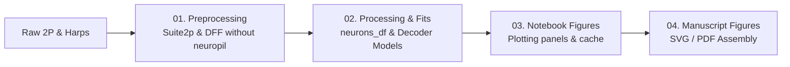

# V1 Depth Map Analysis Tracking

Welcome to the analysis tracking hub for the `v1_depth_map` project. These documents record the status, quality checks, data lineage, and next actions across every step of the pipeline.

## Tracking Documents

| Stage | Document | Purpose & Contents |
| :--- | :--- | :--- |
| **01** | [**01_preprocessing.md**](./01_preprocessing.md) | ✅ Complete — reference only. Suite2p / `2p reextract` procedures, session exclusions, sanity plots / optical offsets |
| **02** | [**02_processing_fits.md**](./02_processing_fits.md) | Fitting pipelines (RF, depth selectivity, RS/OF, ridge decoders), `neurons_df` generation & lineage |
| **03** | [**03_notebook_figures.md**](./03_notebook_figures.md) | Figures Jupyter notebooks execution status, runtimes, memory, errors, and notebook-level tasks |
| **04** | [**04_manuscript_figures.md**](./04_manuscript_figures.md) | Final figure assembly status (Main Figures 1–4, Supplementary Figures S1–S8), SVGs/PDFs, vector layout |

---

## Workflow Overview

---

## Active Environment & Versions
- **Default Figures Version**: `FIGURES_VERSION = "_rev1"` (configured in [paths.py](../v1_depth_map/paths.py))
- **Data Root (Local / Drive)**: `/Volumes/BlackPasspo/v1_depth_map/processed/`
- **Manuscript Figures Export**: `/Volumes/BlackPasspo/v1_depth_map/processed/v1_manuscript_figures/ver_rev1/`
- **Main Projects**:
  - `hey2_3d-vision_foodres_20220101` (Primary experimental dataset)
  - `colasa_3d-vision_revisions` (Revision recordings — uses curated Cellpose/Napari masks requiring `2p reextract`, see [01_preprocessing.md](./01_preprocessing.md#21-revision-sessions-colasa_3d-vision_revisions-why-and-how-to-use-2p-reextract))
  - `ccyp_l5_3d_vision` (L5 recordings)
